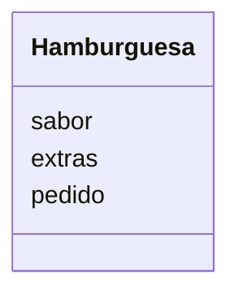

# Análisis

Requisitos:
- ofrecer hamburguesas de res, pollo y vegetarianas
- los bombones pueden acompañarse de lechuga, tomate, cebolla y mayonesa
- las hamburguesas pueden consumirse en el restaurante o para llevar

Objetos:
- Hamburguesa

Características:
- Hamburguesa
    - sabor
    - extras
    - pedido

Acciones:
- (No hay acciones)
# Diseño:

Clases:
- Hamburguesa :
    - Nombre: Hamburguesa
    - Atributos:
        - sabor
        - extras
        - pedido
    - Métodos:
        - (No hay métodos)
  
