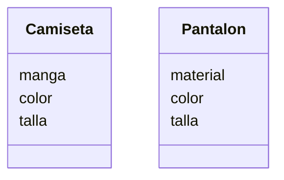

Una tienda de ropa quiere ofrecer camisetas y pantalones
Los clientes pueden elegir entre: camiseta
de manga corta o larga y pantalón de mezclilla o tela
Las camisetas pueden ser de color rojo, azul o verde
y los pantalones de color negro, gris o blanco
Las camisetas tienen las tallas: S, M, L, XL
Los pantalones tienen las tallas desde la 32 hasta la 44
# Análisis
Requisitos:
- Ofrece dos tipos de prenda: camisetas y pantalones
- Ofrecer camisetas de manga corta o larga
- Ofrecer camisetas de color rojo, azul y verde
- Ofecer camisetas de talla S, M, L y XL
- Ofrecer los pantalones de tela: mezclilla o tela
- Ofrecer el color del pantalon negro, gris o blanco
- Ofrecer la talla del pantalon de la 32 al 44

Objetos:
- Camiseta
- Pantalon

Características:
- Camiseta
    - manga
    - color
    - talla
Acciones:
 - No hay acciones
- Pantalon
    - material
    - color
    - talla
Acciones:
- No hay acciones
# Diseño:

Clases:
- Camiseta :
    - Nombre: Camiseta
    - Atributos:
          - manga
          - color
          - talla
    - Métodos:
          - (No hay métodos)
- Pantalon :
    - Nombre: Pantalon
    - Atributos:
          - material
          - color
          - talla
    - Métodos:
          - (No hay métodos)

