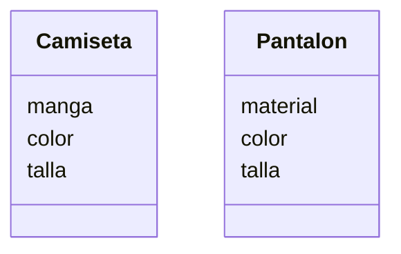

# Análisis

Requisitos:
- ofrece camisetas y pantalones
- la camiseta puede ser de manga corta o larga
- los pantalones pueden ser de mezclilla o tela
- Escoger el color de la camiseta rojo, azul o verde
- Escoger el color del pantalon negro gris o blanco
- Escoger la talla de la camiseta S, M, L, XL
- Escpger la talla del pantalon de la 32 a la 44

Objetos:
- Camiseta
- Pantalon

Características:
- Camiseta
    - manga
    - color
    - talla
- Pantalon
    - material
    - color
    - talla
Acciones:
- (No hay acciones)
# Diseño:

Clases:
- Camiseta :
    - Nombre: Camiseta
    - Atributos:
          - manga
          - color
          - talla
    - Métodos:
        - (No hay métodos)
- Pantalon :
    - Nombre: Pantalon
    - Atributos:
          - material
          - color
          - talla
    - Métodos:
        - (No hay métodos)

