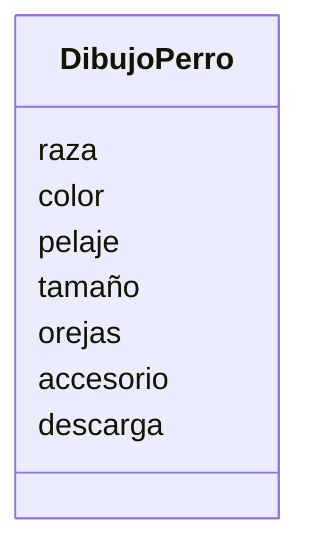

# Análisis

Requisitos:
- dibujar perros de distintas razas
- los perrros pueden tener un color distinto
- Se puede escoger el pelaje
- Se escoge el tamaño
- se escoge el tipo de orejas
- Añadir accesorios
- Escoger el tipo de descarga

Objetos:
- DibujoPerro

Características:
- DibujoPerro
    - raza
    - color
    - pelaje
    - tamaño
    - orejas
    - accesorio
    - descarga

Acciones:
- (No hay acciones)
# Diseño:

Clases:
- Hamburguesa :
    - Nombre: DibujoPerro
    - Atributos:
        - raza
        - color
        - pelaje
        - tamaño
        - orejas
        - accesorio
        - descarga
        - Métodos:
        - (No hay métodos)
  
