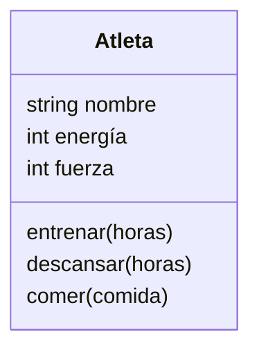

# Análisis
Requisitos:
- Crear atleta
- El atleta tiene un nombre
- El atleta tiene energía
- El atleta tiene fuerza
- El atleta puede entrenar
- El atleta puede descansar
- El atleta puede comer solo hamburguesas
- El atleta al entrenar aumentar su fuerza consume energia
- El atleta al descansar recupera su energía
- El atleta al comer recupera energía
    

Objetos:
- Atleta

Características:
- Persona: Nombre, energía, fuerza

Acciones:
- Persona: entrenar, descansar, comer
  
