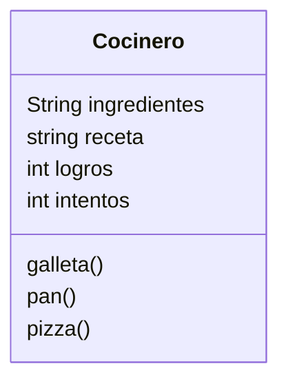

# Análisis
Requisitos:
- Crear cocinero
- El cocinero tiene lista de ingredientes disponibles
- El cocinero tiene recetas para preparar
- El cocinero tiene un contador de intentos 
- El cocinero tiene un contador de logros
- A mas de un cocinero la productividad se acumular

Objetos:
- Cocinero

Características:
- Cocinero: ingredientes, recetas, productividad

Acciones:
- Cocinero: cocina galleta, pan o pizza
  
