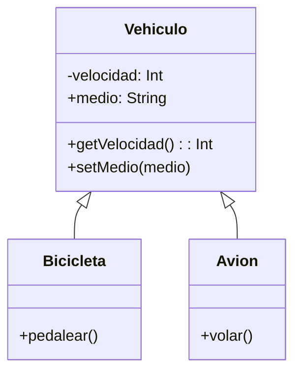

Requisitos funcionales
- Registrar vehículos en la simulación.
- Consultar y modificar el medio de desplazamiento.
- Consultar la velocidad (modificación solo mediante acciones específicas).
- Bicicleta puede pedalear para aumentar velocidad.
- Avión puede volar para aumentar velocidad.

Objetos:
- Vehiculo (clase padre)
- Bicicleta (clase hija)
- Avion (clase hija)
- Reptil (clase hija)
Características:
- Vehiculo:
  - velocidad: Int
  - medio: String (terrestre, acuatico, aéreo)
- Avion:
  - velocidad: Int (hereda) 
- Bicicleta
  - velocidad: Int (hereda)
Acciones:
- Vehiculo:
  - getVelocidad()
  - setMedio()
- Avion:
  - volar()
- Bicicleta:
  - pedalear()

