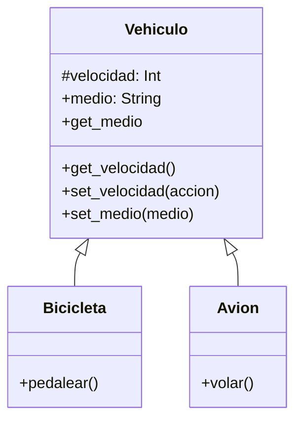

# Análisis
Requisitos:
- Registrar el comportamiento de los vehiculos
- Un vehiculo tiene velocidad 
- Lavelocidad es un dato protegido
- Se consulta la velocidad pero se modifica con accciones
- Un vehiculo tiene un medio (terrestre, acuatico y aereo)
- El medio se consulta y se modifica
- Una bicicleta es un vehiculo
- La bicicleta aumenta la velocidad cuando se pedalea
- Un avion es un vehiculo
- El avion aumenta la velocidad cuando vuela 
Objetos:
- Vehiculo (clase padre)
- Bicicleta (clase hija)
- Avion (clase hija)

Características:
- Vehiculo:
  - velocidad: int
  - medio: String (terrestre, acuatico, aéreo)

Acciones:
- Vehiculo:
  - get_velocidad()
  - set_velocidad(accion)
  - get_medio()
  - set_medio()
  - mostrar()
- Avion:
  - volar()
  - mostrar()
- Bicicleta:
  - pedalear()
  - mostrar()

# Diseño:
Clases:
- Vehiculo :
    - Nombre: Vehiculo
    - Atributos:
          - velocidad
          - medio
    - Métodos:
          - get_velocidad()
          - set_velocidad(accion)
          - get_medio()
          - set_medio()
          - mostrar()
- Avion :
    - Nombre: Avion 
    - Atributos: Sin atributos
    - Métodos:
          - volar()
          - mostrar()
- Vicicleta:
    - Nombre: Bicicleta 
    - Atributos: Sin atributos
    - Métodos:
          - pedalear()
          - mostrar()

