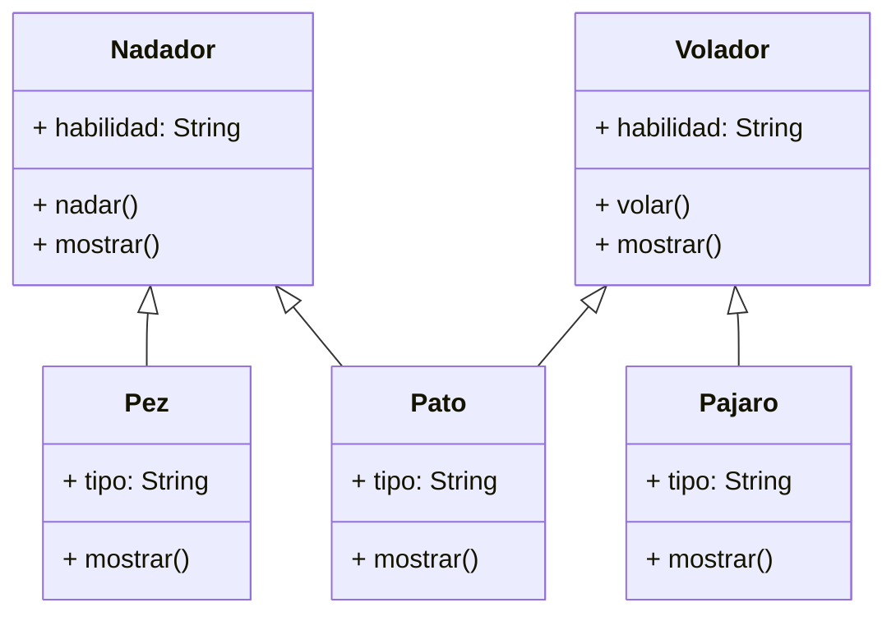

# Descripción
Debes desarrollar un videojuego tipo aventura, donde los personajes tiene distintas habilidades Cada personaje pertenece a uno o más tipos que definen sus comportamientos:
Nadador: Puede ejecutar la acción nadar(), que representa la acción de desplazarse en el agua. Volador: Puede ejecutar la acción volar(), que representa la acción de desplazarse por el aire. En el juego existen tres personajes principales, cada uno con habilidades específicas:
Pez: tiene la habilidad de nadar. Pájaro: tiene la habilidad de volar. Pato: tiene ambas habilidades, puede nadar y volar. Cada personaje debe contar con un método mostrar() que indique el tipo de personaje y su habilidad principal o combinada. Realiza el análisis y diagrama de clases de las clases Nadador, Volador, Pez, Pajaro y Pato

# Requisitos
- Desarrollar un videojuego
- Crear personajes con habilidades.
- Cada personaje puede tener una o más habilidades: nadar y/o volar.
- El juego tiene 3 personajes: pez, pájaro y pato
- El pez nada
- El pájaro vuela
- El pato nada y vuela
- Cada personaje tiene el metodo mostrar (tipo y habilidad).

Objetos:
- Nadador (clase padre)
- Volador (clase padre)
- Pez (clase hija)
- Pajaro (clase hija)
- Pato (clase hija)
Características:
- Nadador:
  - habilidad: String
- Volador:
  - habilidad: String
- Pez
  - tipo: String
- Pajaro
  - tipo: String
- Pato
  - tipo: String
Acciones:
- Nadador:
  - nadar()
  - mostrar()
- Volador:
  - volar()
  - mostrar()
- Pez
   - mostrar()
- Pajaro
   - mostrar()
- Pato
   - mostrar()

