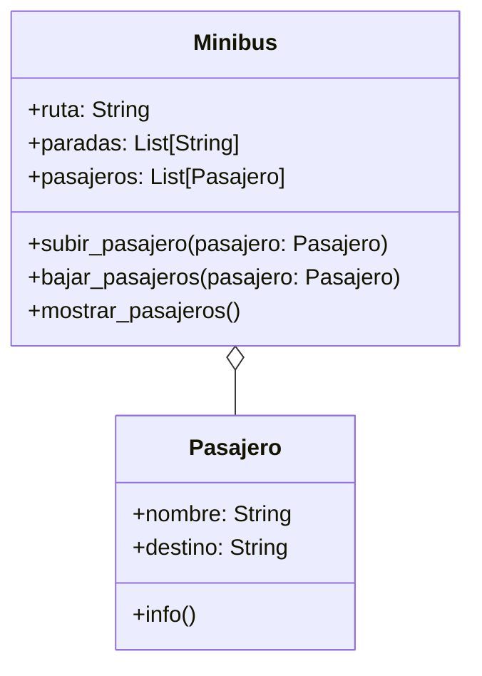

# Análisis
- Representar minibuses con número de ruta y lista de paradas.
- Representar pasajeros con nombre y destino.
- Permitir que un pasajero suba al minibús si su destino está en el recorrido.
- Permitir que un pasajero baje si la parada actual coincide con su destino.
- Invertir el recorrido al llegar al final (recorrido circular).
- Mostrar el estado actual del minibús y sus pasajeros.

# Características
- Pasajero:
    - nombre: String
    - destino: String
- Minibus:
    - ruta: String
    - paradas: String
    - pasajeros: List[Pasajero]

Acciones:
- Pasajero:
  - info()
- Minibus:
  - subir_pasajero()
  - bajar_pasajero()
  - mostrar_pasajeros()
  

