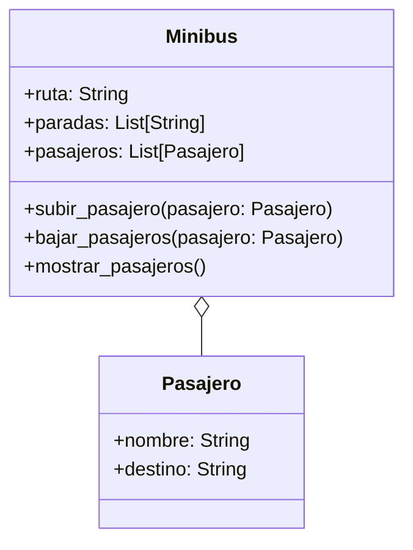

# Análisis
- Representar minibuses con número de ruta y paradas
- Representar pasajeros con nombre y destino.
- El pasajero se sube si coincide su destino en alguna parada
- El pasajero puede bajar si la parada coincide con el destino
- Invertir el recorrido al llegar al final (recorrido circular).

# Características
- Pasajero:
    - nombre: String
    - destino: String
- Minibus:
    - ruta: String
    - paradas: String
    - pasajeros: List[Pasajero]

Acciones
- Minibus:
  - subir_pasajero()
  - bajar_pasajero()
  - mostrar_pasajeros()
  

