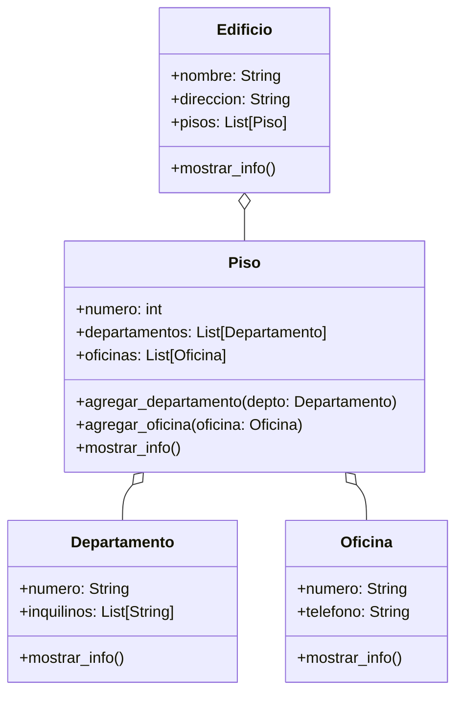

# Análisis
Requisitos:
- Representar un edificio con nombre y dirección.
- El edificio contiene 3 pisos, cada uno identificado por su número.
- Cada piso puede tener:departamento y/o oficianas
- Departamentos: numerados 
- Oficinas: numeradas con el piso seguido de letra
- El edificio tiene direccion y nombre
- los pisos tienen numero
- las oficinas tienen teléfono
- los departamentos tienen inquilino
- Se debe acceder y mostrar informacion del edificio

Objetos:
- Piso
- Departamento
- Oficina
- Edificio
Características:
- Piso:
    - numero: int
    - departamentos: List[Departamento]
    - oficinas: List[Oficina]
- Departamento
    - numero: String
    - inquilinos: List[String]
- Oficina
    - numero: string
    - telefono: int
- Edificio:
    - direccion: String
    - nombre: String
Acciones:
- Piso:
    - agregar_departamento(departamento:departamento)
    - agregar_oficina(oficina:oficina)
- Departamento:
    - mostrar()
- Oficina
    - mostrar()
  

