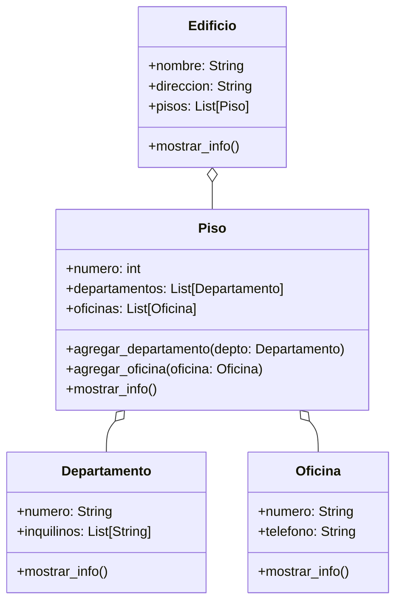

# Análisis
Requisitos:
- Representar un edificio con nombre y dirección.
- El edificio contiene 3 pisos, cada uno identificado por su número.
- Cada piso puede tener:
  - Departamentos: numerados con el piso seguido de unidad (ej. 201, 304).
  - Oficinas: numeradas con el piso seguido de letra (ej. 2A, 3C).
- Los departamentos tienen una lista de inquilinos.
- Las oficinas tienen un número de teléfono.
- El sistema debe permitir:
  - Crear el edificio con sus pisos.
  - Agregar departamentos y oficinas a cada piso.
- Mostrar la información del edificio de forma jerárquica

Objetos:
- Piso
- Departamento
- Oficina
- Edificio
Características:
- Piso:
    - numero: int
    - departamentos: List[Departamento]
    - oficinas: List[Oficina]
- Departamento
    - numero: String
    - inquilinos: List[String]
- Oficina
    - numero: string
    - telefono: int
- Cuerpo:
    - nombre: String
    - corazón: Corazón
Acciones:
- Piso:
    - agregar_departamento(departamento:departamento)
    - agregar_oficina(oficina:oficina)
- Departamento:
    - mostrar()
- Oficina
    - mostrar()
  

