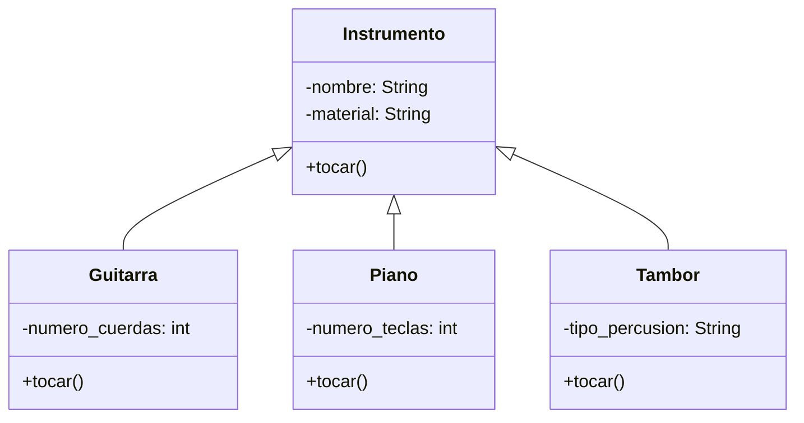

# Análisis
Requisitos
- Permitir a los usuarios practicar con distintos instrumentos
- La guitarra emite el sonido strum
- El piano emite el sonido plin
- El tambor emite el sonido boom

Objetos
- Instrumento
    - Guitarra
    - Piano
    - Tambor

Características
- Instrumento: material,nombre
- Guitarra: numero_cuerdas
- Piano: numero_teclas
- Tambor: Tipo_percusion

Acciones
- Guitarra:tocar
- Piano: tocar
- Tambor tocar
- Instrumento:  tocar

