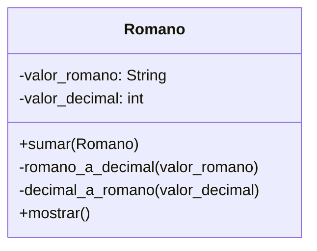

# Análisis
Requisitos
- Crear una calculadora de numeros romanos
- Los numeros romanos se almacenan como cadena
- Se debe convertir numeros a romanos
- El resultado debe ser en numeros romanos

Objetos
valor

Característica
valor: romano, decimal
Acciones

