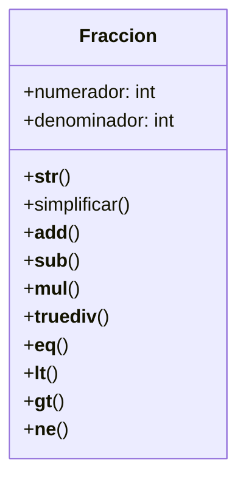

# Análisis
Requisitos
- Debe tener un constructor que reciba numerador y denominador.
- Debe almacenar estos valores en atributos de instancia.
- Debe representarse visualmente como "numerador/denominador".
- Debe poder sumar fracciones con +.
- Debe poder restar fracciones con -.
- Debe poder multiplicar fracciones con *.
- Debe poder dividir fracciones con /.
- Debe poder compararse con otras fracciones y ver si son iguales.
- Debe poder compararse con otras fracciones y ver si es menor a otra.
- Debe poder compararse con otras fracciones y ver si es mayo a otra.
- Debe poder compararse con otras fracciones y ver si es distinta a otra.

Objetos
- Fraccion
 
Características
- Fraccion: numerador, denominador
 
Acciones
- Fraccion: representación
- Fraccion: suma, resta, multiplicación, división
- Fraccion: comparaciones menor, mayor y desigualdad
