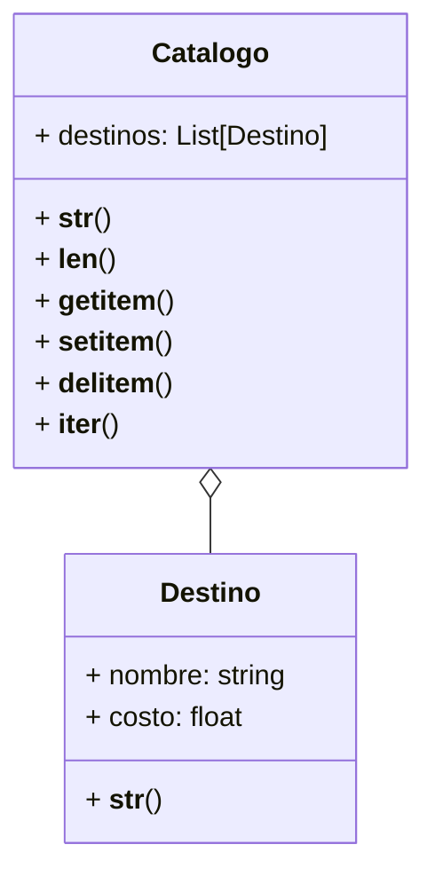

# Análisis
Requisitos
- La agencia necesita gestionar un catálogo digital de destinos turísticos.
- Cada destino debe tener un nombre y un costo.
- El destino debe representarse como: "[destino] ➡ [costo] USD"
- El catálogo de destinos debe representarse como:
🗺 Destinos 🗺
1. destino1
2. destino2
...
n. destinoN
- Los destinos se almacenan dentro de una lista en el catálogo.
- El catálogo debe permitir conocer cuántos destinos hay.
- El catálogo debe permitir acceder a destinos por su índice.
- El catálogo debe permitir agregar destinos mediante asignación.
- El catálogo debe permitir eliminar destinos.
- El catálogo debe permitir iterar sobre los destinos.
- El catálogo debe permitir ver el catalaogo en los formatos especificados.
- El catálogo debe permitir ver los destinos en los formatos especificados.

Objetos
- Destino
- Catalogo

Características
- Destino: nombre, costo
- Catalogo: colección de destinos

Acciones
- Destino: representación
- Catalogo: longitud y representacion
- Catalogo: acceso a destinos por indice, agregar, modificar, eliminar, iterar un destino.

