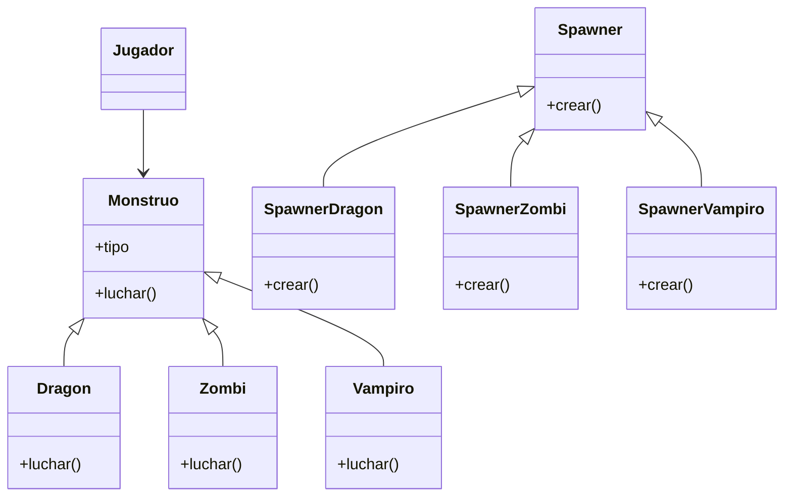

Requisitos:
- Hay tres tipos de monstruos: Dragón, Zombi y Vampiro
- Dos jugadores deben elegir un monstruo.
- Cada monstruo tiene fortalezas y debilidades según las reglas.
- Los monstruos se crean mediante fabricas (Spawner).
- El simulador compara monstruos y anuncia un ganador 
- Si se ingresa "salir" se termina la partida.

Objetos:
- Monstruo (Dragon, Zombi, Vampiro)
- Spawner (Spawner_dragon, Spawner_zombi, Spawner_vampiro)
- Jugador

Características:
- Monstruo: (sin características extra)
- Dragon: (Monstruo)
- Zombi: (Monstruo)
- Vampiro (Monstruo)
- Spawner: (sin características)
- Spawner_dragon: (Spawner)
- Spawner_zombi: (Spawner)
- Spawner_vampiro: (Spawner)
- Jugador(sin características)

Acciones:
- Monstruo: lucha()
- Dragon: luchar()
- Zombi: luchar()
- Vampiro: luchar()
- Spawner: crea()
- Spawner_dragon: crea()
- Spawner_zombi: crea()
- Spawner_vampiro: crea()
- Jugador: (sin acciones)

