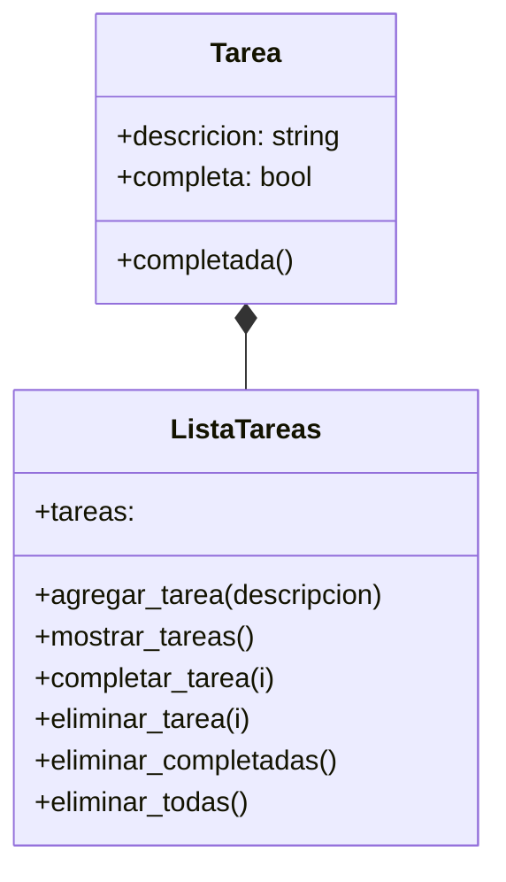

# Análisis
Requisitos:
- Un programa que permita gestionar tareas
- Agregar nuevas tareas
- Ver tareas
- Marcar tareas como completadas
- Eliminar tareas individuales
- Eliminar solo tareas completadas
- Eliminar todas las tareas

Objetos:
- Tarea
- Lista_tareas

Características:
- Tarea:
    - descripcion: String
    - completa: bool
- Lista_tareas:
    - nombre

Acciones:
- Tarea:
    - marcar_completada
- Lista_tareas:
    - agregar_tarea
    - mostrar_tareas
    - completar_tarea
    - eliminar_tarea
    - eliminar_completadas
    - eliminar_todas

