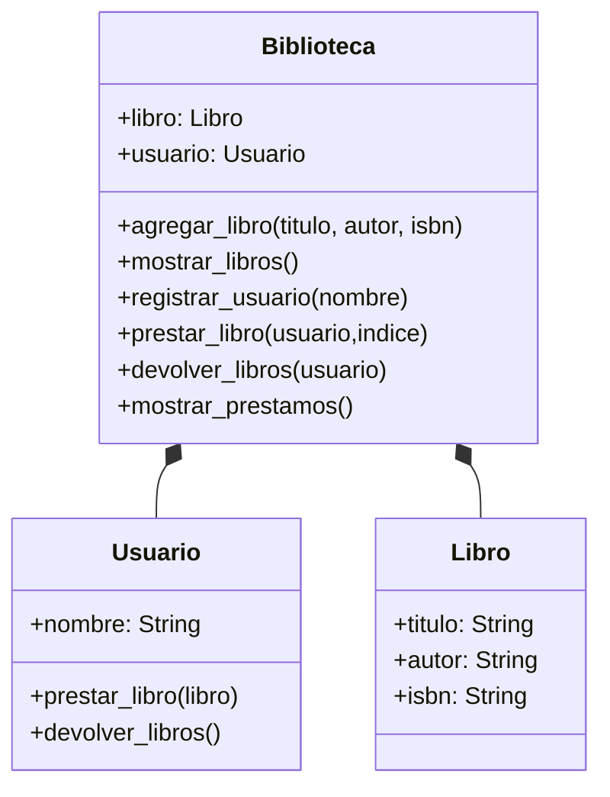

# Analisis
Requisitos:
- Digitalizar los registros de prestamos
- Guardar informacion de un libro: título, autor e ISBN informacion
- Guardar informacion de usuarios: nombre
- Ingresar el nombre del usuario
- Listar los librps
- Elegir un libro a prestarse
- registrar la lista de prestamos
- Devolve todos los libros

Objetos:
- Libro
- Usuario
- Biblioteca
  
Características:
- Usuario:
  - nombre
- Libro
  - titulo
  - autor
  - isbn
- Biblioteca:
  - libro
  - usuario

Acciones:
- Usuario:
  - prestar_libro(libro)
  - devolver_libros()
- Libro
   (No tiene acciones)
- Biblioteca:
  - agregar_libro(titulo, autor, isbn)
  - mostrar_libros()
  - registrar_usuario(nombre)
  - prestar_libro(usuario,indice)
  - devolver_libros(usuario)
  - mostrar_prestamos()

