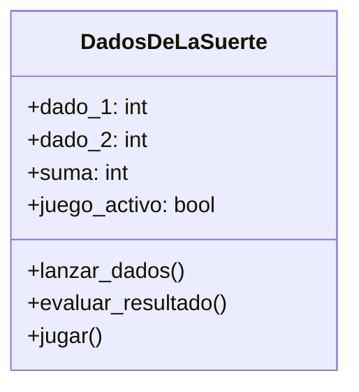

# Analisis
Requisitos:
- Simular el lanzamiento de dos dados.
- Calcular la suma de los dados.
- Evaluar el resultado según las reglas del juego.
- Permitir al jugador decidir si desea volver a lanzar.

Objetos:
- DadosDeLaSuerte

Atributos
- DadosDeLaSuertesuerte:
    - dado_1: int
    - dado_2: int
    - suma: int
    - juego_activo: bool

Acciones:
  - lanzar_dados()
  - evaluar_resultado()
  - jugar()

