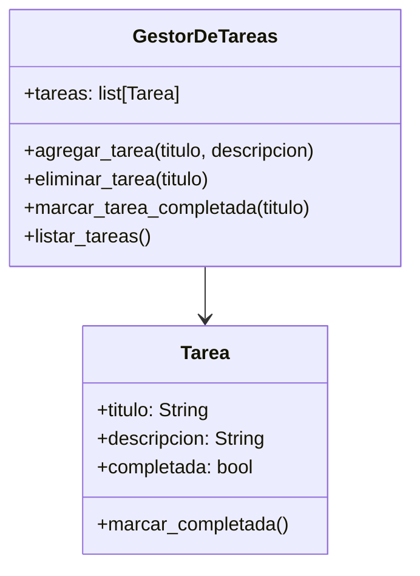

# Análisis

Requisitos:
- Crear un programa para gestionar tareas.
- Un progrma capas de agregar, eliminar y marcar tareas.
- Una tarea tiene titulo, descripcion y estado

Objetos:

- Tarea
- GestorDeTareas

Características:
- Tarea:
  - titulo: String
  - descripción: String
  - completada: bool
- GestorDeTareas:
  - tareas: list[Tarea]

Acciones:
- Tarea
    - marcar_completada()
- GestorDeTareas
    - agregar_tarea()
    - eliminar_tarea()
    - marcar_tarea_completada()
    - listar_tareas()
 
