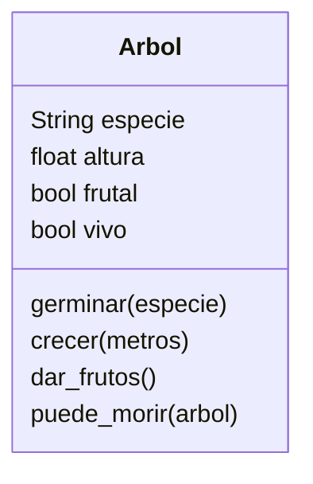

# Análisis

Requisitos:
- Crear un árbol
- Los árboles tienen una especie
- Los árboles pueden ser frutales o no
- Los árboles germinan desde una semilla
- Los árboles crecen con el tiempo
- Los árboles dan frutos cuando tienen 10 metros de altura
- Los árboles mueren cuando tienen más de 15 metros

Objetos:
- Árbol

Características:
- Árbol: especie, altura, frutal, vivo

Acciones:
- Árbol: nacer, crecer, dar_frutos, morir

