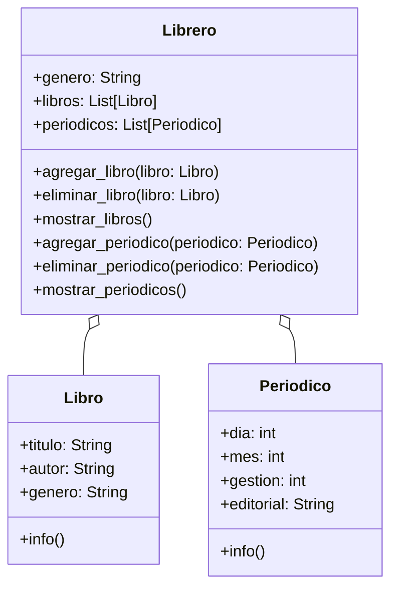

ENTIENDE EL SIGUIENTE ANÁLISIS: Una biblioteca guarda en un sistema el título, autor y género de sus libros. Existen libreros digitales para organizar Los libros están organizados por género, y se puede agregar o eliminar libros de cada librero. Se puede mostrar todos los libros de un librero Actualmente existen 2 géneros:
- Cocina
- Arte Los libros de cada uno de estos géneros son:
- Cocina
- Cocina Criolla Boliviana, Daniel Figliuzzi
- Gran libro cocina Boliviana, Jaime Cisneros
- Arte
- Arte textil y mundo andino, Teresa Gisbert
- Arte contemporáneo en Bolivia, Galería Altamira
Análisis
Requisitos:
- Guardar información de libros (título, autor, género)
- Organizar libros por género en libreros
- Mostrar libros de cada librero
- Mostrar la información de un libro
- Periódicos tienen dia, mes, gestión y editorial
- Guardar periódicos en los libreros
- Mostrar la información de un periódico
- Mostrar periódicos de cada librero Objetos:
- Libro
- Librero
- Periódico Características:
- Libro:
- título: String
- autor: String
- género: String
- Periódico:
- dia: int
- mes: int
- gestión: int
- editorial: String
- Librero:
- género: String
- libros: List[Libro]
- periódicos: List[Periódico] Acciones:
- Libro:
- info()
- Periódico:
- info()
- Librero:
- agregar_libro(libro)
- eliminar_libro(libro)
- mostrar_libro()
- agregar_periodico(periodico)
- eliminar_periodico(periodico)
- mostrar_periodicos()
classDiagram
    class Libro {
        +titulo: String
        +autor: String
        +genero: String
        +info()
    }
    class Periodico {
        +dia: int
        +mes: int
        +gestion: int
        +editorial: String
        +info()
    }
    class Librero {
        +genero: String
        +libros: List[Libro]
        +periodicos: List[Periodico]
        +agregar_libro(libro: Libro)
        +eliminar_libro(libro: Libro)
        +mostrar_libros()
        +agregar_periodico(periodico: Periodico)
        +eliminar_periodico(periodico: Periodico)
        +mostrar_periodicos()
    }
 
    Librero o-- Libro
    Librero o-- Periodico

