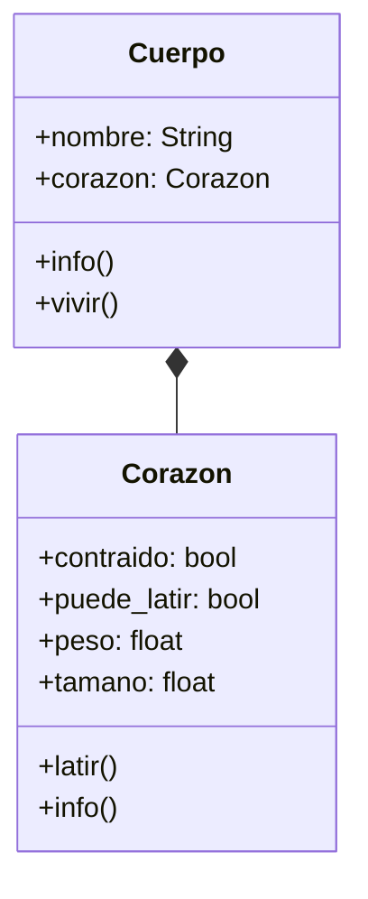

# Análisis
Requisitos:
- Guardar información del corazón (peso, tamaño)
- Guardar información del cuerpo (nombre, corazón)
- Cuando esta contraído hace diástole
- Cuando esta relajado hace sístole
- El cuerpo puede vivir si el corazón puede latir
Objetos:
- Corazón
- Cuerpo
Características:
- Corazón:
    - peso: float
    - tamaño: float
    - contraido: bool
    - puede_latir: bool
- Cuerpo:
    - nombre: String
    - corazón: Corazón
Acciones:
- Corazón:
    - latir()
    - info()
- Cuerpo:
    - info()
    - vivir()

